# Component Flow Diagram

This document maps the main pages in the app to the components they render, whether each component is a server or client component, which APIs they use, and the props they receive.

---

## 1. App Root

### [src/app/layout.tsx](src/app/layout.tsx)
- Type: Server component
- Purpose: app shell, wraps all pages with providers and global UI
- Child components:
  - [src/components/layout/NavBar/NavBar.tsx](src/components/layout/NavBar/NavBar.tsx) — client component
  - [src/Providers.tsx](src/Providers.tsx) — client component
  - global toaster

### [src/Providers.tsx](src/Providers.tsx)
- Type: Client component
- Purpose: provides authentication, cart, and wishlist contexts
- Child providers:
  - [src/Context/CartContextProvider.tsx](src/Context/CartContextProvider.tsx)
  - [src/Context/WishlistContextProvider.tsx](src/Context/WishlistContextProvider.tsx)
  - [next-auth SessionProvider](https://next-auth.js.org/)

---

## 2. Home Page

### [src/app/page.tsx](src/app/page.tsx)
- Type: Server component
- API calls:
  - [src/APIs/product.api.ts](src/APIs/product.api.ts) → getAllProducts()
  - [src/APIs/category.api.ts](src/APIs/category.api.ts) → getAllCategories()
- Renders:
  - [src/components/layout/Home/HeroSection.tsx](src/components/layout/Home/HeroSection.tsx) — server component
  - [src/components/layout/Home/CarouselSection.tsx](src/components/layout/Home/CarouselSection.tsx) — server component (generic wrapper)
  - [src/components/layout/Common/Card/CategoriesCard.tsx](src/components/layout/Common/Card/CategoriesCard.tsx) — server component
  - [src/components/layout/Common/Card/ProductsCard.tsx](src/components/layout/Common/Card/ProductsCard.tsx) — server component

---

## 3. Products Page

### [src/app/products/page.tsx](src/app/products/page.tsx)
- Type: Server component
- API calls:
  - [src/APIs/product.api.ts](src/APIs/product.api.ts) → getAllProducts()
  - [src/APIs/category.api.ts](src/APIs/category.api.ts) → getAllCategories()
- Renders:
  - [src/components/layout/Common/PageTitle/PageTitle.tsx](src/components/layout/Common/PageTitle/PageTitle.tsx) — server component
  - [src/components/layout/Products/ProductSection.tsx](src/components/layout/Products/ProductSection.tsx) — server/client depending on implementation

---

## 4. Product Details Page

### [src/app/products/[id]/page.tsx](src/app/products/[id]/page.tsx)
- Type: Server component
- Props:
  - params: route params containing product id
- API calls:
  - [src/APIs/product.api.ts](src/APIs/product.api.ts) → getProductById(id)
  - [src/APIs/reviews.api.ts](src/APIs/reviews.api.ts) → getProductReviews(id)
- Renders:
  - [src/components/layout/Buttons/CartBtn.tsx](src/components/layout/Buttons/CartBtn.tsx) — client component
  - [src/components/layout/Buttons/WishlistBtn.tsx](src/components/layout/Buttons/WishlistBtn.tsx) — client component
  - [src/components/layout/Common/ImgCarousel/ImgCarousel.tsx](src/components/layout/Common/ImgCarousel/ImgCarousel.tsx) — client component
  - [src/components/layout/reviews/StarRating.tsx](src/components/layout/reviews/StarRating.tsx) — server/client depending on implementation
  - [src/components/layout/reviews/ProductReviewsSection.tsx](src/components/layout/reviews/ProductReviewsSection.tsx) — client component

#### Child props summary
- CartBtn
  - props: id, productdetails
- WishlistBtn
  - props: id, productdetails
- ImgCarousel
  - props: images
- ProductReviewsSection
  - props: id, initialReviews

---

## 5. Brands Page

### [src/app/brands/page.tsx](src/app/brands/page.tsx)
- Type: Server component
- API calls:
  - [src/APIs/brand.api.ts](src/APIs/brand.api.ts) → getAllBrands()
- Renders:
  - [src/components/layout/Common/PageTitle/PageTitle.tsx](src/components/layout/Common/PageTitle/PageTitle.tsx) — server component
  - plain Link + Image blocks

---

## 6. Brand Details Page

### [src/app/brands/[id]/page.tsx](src/app/brands/[id]/page.tsx)
- Type: Server component
- Props:
  - params: route params containing brand id
- API calls:
  - [src/APIs/brand.api.ts](src/APIs/brand.api.ts) → getBrandById(id)
  - [src/APIs/product.api.ts](src/APIs/product.api.ts) → getAllProducts()
- Renders:
  - [src/components/layout/Common/Card/ProductsCard.tsx](src/components/layout/Common/Card/ProductsCard.tsx) — server component
  - [src/components/layout/Common/NoProducts/NoProducts.tsx](src/components/layout/Common/NoProducts/NoProducts.tsx) — server component

---

## 7. Categories Page

### [src/app/categories/page.tsx](src/app/categories/page.tsx)
- Type: Server component
- API calls:
  - [src/APIs/category.api.ts](src/APIs/category.api.ts) → getAllCategories()
- Renders:
  - [src/components/layout/Common/PageTitle/PageTitle.tsx](src/components/layout/Common/PageTitle/PageTitle.tsx) — server component
  - [src/components/layout/Common/Card/CategoriesCard.tsx](src/components/layout/Common/Card/CategoriesCard.tsx) — server component

---

## 8. Category Details Page

### [src/app/categories/[id]/page.tsx](src/app/categories/[id]/page.tsx)
- Type: Server component
- Props:
  - params: route params containing category id
- API calls:
  - [src/APIs/category.api.ts](src/APIs/category.api.ts) → getCategoriesById(id)
  - [src/APIs/product.api.ts](src/APIs/product.api.ts) → getAllProducts()
- Renders:
  - [src/components/layout/Common/Card/ProductsCard.tsx](src/components/layout/Common/Card/ProductsCard.tsx) — server component
  - [src/components/layout/Common/NoProducts/NoProducts.tsx](src/components/layout/Common/NoProducts/NoProducts.tsx) — server component

---

## 9. Cart Page

### [src/app/cart/page.tsx](src/app/cart/page.tsx)
- Type: Server component
- Renders:
  - [src/components/layout/Common/PageTitle/PageTitle.tsx](src/components/layout/Common/PageTitle/PageTitle.tsx) — server component
  - [src/components/layout/cart/CartProductsSection.tsx](src/components/layout/cart/CartProductsSection.tsx) — client component

---

## 10. Wishlist Page

### [src/app/wishlist/page.tsx](src/app/wishlist/page.tsx)
- Type: Server component
- Renders:
  - [src/components/layout/Common/PageTitle/PageTitle.tsx](src/components/layout/Common/PageTitle/PageTitle.tsx) — server component
  - [src/components/layout/Wishlist/WishlistProductsSection.tsx](src/components/layout/Wishlist/WishlistProductsSection.tsx) — client component

---

## 11. Profile Page

### [src/app/profile/page.tsx](src/app/profile/page.tsx)
- Type: Server component
- API calls:
  - [src/Actions/ProfileActions/getloggedUserAddressesAction.ts](src/Actions/ProfileActions/getloggedUserAddressesAction.ts) — server action
- Renders:
  - [src/components/layout/Profile/ProfileSection.tsx](src/components/layout/Profile/ProfileSection.tsx) — client component

#### Child props summary
- ProfileSection
  - props: addresses

---

## 12. Payment Page

### [src/app/payment/page.tsx](src/app/payment/page.tsx)
- Type: Client component
- Uses:
  - [src/hooks/usePayment.ts](src/hooks/usePayment.ts) — client hook
  - [src/components/layout/Buttons/LoadingBtn.tsx](src/components/layout/Buttons/LoadingBtn.tsx) — server/client wrapper depending on implementation
  - [src/lib/toast.ts](src/lib/toast.ts) — helper

---

## 13. Orders Page

### [src/app/allorders/page.tsx](src/app/allorders/page.tsx)
- Type: Server component
- API calls:
  - [src/Actions/OrderActions/getUserOrderAction.ts](src/Actions/OrderActions/getUserOrderAction.ts) — server action
- Renders:
  - [src/components/layout/Common/NoProducts/NoProducts.tsx](src/components/layout/Common/NoProducts/NoProducts.tsx) — server component

---

## 14. Auth Pages

### [src/app/(Auth)/login/page.tsx](src/app/(Auth)/login/page.tsx)
- Type: Client component
- Uses:
  - [src/components/ui/form](src/components/ui/form) primitives
  - [src/components/ui/input](src/components/ui/input)
  - [next-auth signIn](https://next-auth.js.org/)

### [src/app/(Auth)/register/page.tsx](src/app/(Auth)/register/page.tsx)
- Type: Client component
- Uses:
  - form UI primitives
  - auth API via NextAuth / backend endpoints

### [src/app/(Auth)/(ResetPassword)/forget-password/page.tsx](src/app/(Auth)/(ResetPassword)/forget-password/page.tsx)
- Type: Client component
- Uses:
  - auth reset endpoint

### [src/app/(Auth)/(ResetPassword)/reset-password/page.tsx](src/app/(Auth)/(ResetPassword)/reset-password/page.tsx)
- Type: Client component
- Uses:
  - auth reset endpoint

---

## 15. Mermaid Diagram

```mermaid
flowchart TD
  A[App Layout] --> B[Navbar]
  A --> C[Providers]
  C --> D[SessionProvider]
  C --> E[CartContextProvider]
  C --> F[WishlistContextProvider]

  G[Home Page] --> H[HeroSection]
  G --> I[CarouselSection]
  I --> J[CategoriesCard]
  I --> K[ProductsCard]

  L[Products Page] --> M[PageTitle]
  L --> N[ProductSection]

  O[Product Details Page] --> P[CartBtn]
  O --> Q[WishlistBtn]
  O --> R[ImgCarousel]
  O --> S[ProductReviewsSection]
  S --> T[ReviewForm]
  S --> U[ReviewUpdate]
  S --> V[ReviewsList]

  W[Brands Page] --> X[PageTitle]
  W --> Y[Brand Cards]

  Z[Brand Details Page] --> AA[ProductsCard]
  Z --> AB[NoProducts]

  AC[Categories Page] --> AD[PageTitle]
  AC --> AE[CategoriesCard]

  AF[Category Details Page] --> AG[ProductsCard]
  AF --> AH[NoProducts]

  AI[Cart Page] --> AJ[PageTitle]
  AI --> AK[CartProductsSection]
  AK --> AL[CartCard]

  AM[Wishlist Page] --> AN[PageTitle]
  AM --> AO[WishlistProductsSection]
  AO --> AP[ProductsCard]

  AQ[Profile Page] --> AR[ProfileSection]
  AR --> AS[EditProfileTab]
  AR --> AT[AdressesTab]
  AR --> AU[EditPasswordTab]

  AV[Payment Page] --> AW[LoadingBtn]

  AX[Orders Page] --> AY[NoProducts]

  AZ[Login Page] --> BA[signIn]
  AZ --> BB[Form Inputs]
```

---

## 16. Shared Components and Their Props

### [src/components/layout/Common/Card/ProductsCard.tsx](src/components/layout/Common/Card/ProductsCard.tsx)
- Props:
  - product: Product
- Uses:
  - CartBtn
  - WishlistBtn
  - StarRating

### [src/components/layout/Common/Card/CategoriesCard.tsx](src/components/layout/Common/Card/CategoriesCard.tsx)
- Props:
  - category: Category

### [src/components/layout/Common/Card/CartCard.tsx](src/components/layout/Common/Card/CartCard.tsx)
- Props:
  - product: CartItem
- Uses:
  - cart actions via hook/context

### [src/components/layout/Common/NoProducts/NoProducts.tsx](src/components/layout/Common/NoProducts/NoProducts.tsx)
- Props:
  - text: string

### [src/components/layout/Common/PageTitle/PageTitle.tsx](src/components/layout/Common/PageTitle/PageTitle.tsx)
- Props:
  - title: string

### [src/components/layout/Home/CarouselSection.tsx](src/components/layout/Home/CarouselSection.tsx)
- Props:
  - title: string
  - items: T[]
  - getKey: (item) => string
  - renderItem: (item) => React.ReactNode
  - itemClassName?: string
  - loop?: boolean

### [src/components/layout/Profile/ProfileSection.tsx](src/components/layout/Profile/ProfileSection.tsx)
- Props:
  - addresses: ShippingAddress[]

### [src/components/layout/Profile/AdressesTab.tsx](src/components/layout/Profile/AdressesTab.tsx)
- Props:
  - addresses: ShippingAddress[]

### [src/components/layout/reviews/ProductReviewsSection.tsx](src/components/layout/reviews/ProductReviewsSection.tsx)
- Props:
  - id: string
  - initialReviews: Review[]

### [src/components/layout/reviews/ReviewForm.tsx](src/components/layout/reviews/ReviewForm.tsx)
- Props:
  - isSubmitting: boolean
  - onSubmit: (values) => void

### [src/components/layout/reviews/ReviewUpdate.tsx](src/components/layout/reviews/ReviewUpdate.tsx)
- Props:
  - review: Review
  - isSaving: boolean
  - isDeleting: boolean
  - onSave: (values) => void
  - onDelete: () => void

---

## 16. Context and Hooks Flow

### Cart flow
- Page → CartProductsSection → useCart() → CartContextProvider → addToCartAction / getUserCartAction / removeCartAction / updateCartAction

### Wishlist flow
- Page → WishlistProductsSection → useWishlist() → WishlistContextProvider → addToWishlistAction / getUserWishlistAction / removeWishlistAction

### Auth flow
- App root → SessionProvider → useSession() in NavBar / ProfileSection / auth pages
